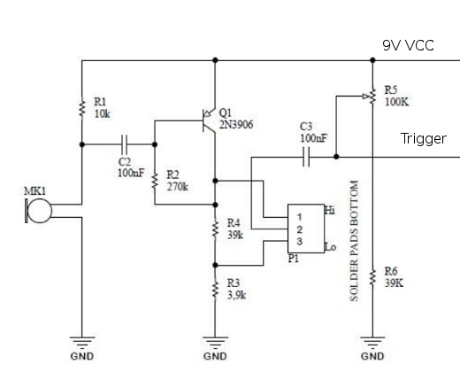

# doorbell-gateway

## Introduction

This is a DIY [ESP8266](https://en.wikipedia.org/wiki/ESP8266)-based doorbell gateway.

The idea is that a microphone and a small pre-conditioning circuit prepares an analogue signal to be sampled and converted to digits by the controller (integrated ADC). The voltage signal is subtracted by a user-defined offset and a simple algorithm is used to detect the ring of the doorbell by setting an amplitude threshold.

On every ring the software posts a configurable MQTT message which can then be used to switch on a buzzer, blink some LEDs, send you an email or a notification on your smartphone, ... - ideas are endless.

The code has been written in the Arduino IDE as it provides simple, ready-to-use libraries.

## Hardware setup

I've been using an ESP-12E (NodeMCU 1.0) which uses an ESP8266. Other boards might be compatible as well.

The signal conditioning circuit is based on the [Claplight MKII 2017](https://kitbuilding.org/index.php?option=com_virtuemart&view=productdetails&virtuemart_product_id=90&virtuemart_category_id=12&lang=en) made by [kitbuilding.org](https://kitbuilding.org/index.php?lang=en). The kit can be bought for ~4 € from their web-shop (they sell other great soldering kits, too!).

This part of the schematic is based on an 2N3906 PNP bipolar transistor:

The kit is powered by a 9V battery. The trigger and GND signals are connected to the NodeMCU.