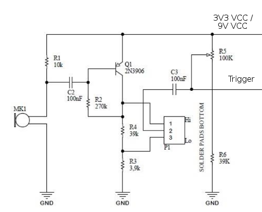

# doorbell-gateway

## Introduction

This is a DIY [ESP8266](https://en.wikipedia.org/wiki/ESP8266)-based doorbell gateway.

The idea is that a microphone and a small pre-conditioning circuit prepares an analogue signal to be sampled and converted to digits by the controller (integrated ADC). The voltage signal is subtracted by a user-defined offset and a simple algorithm is used to detect the ring of the doorbell by setting an amplitude threshold.

On every ring the software posts a configurable MQTT message which can then be used to switch on a buzzer, blink some LEDs, send you an email or a notification on your smartphone, ... - ideas are endless.

The code has been written in the Arduino IDE as it provides simple, ready-to-use libraries.


## Hardware setup

I've been using an ESP-12E (NodeMCU 1.0) which uses an ESP8266. Other boards might be compatible as well.

The signal conditioning circuit is based on the [Claplight MKII 2017](https://kitbuilding.org/index.php?option=com_virtuemart&view=productdetails&virtuemart_product_id=90&virtuemart_category_id=12&lang=en) made by [kitbuilding.org](https://kitbuilding.org/index.php?lang=en). The kit can be bought for ~4 € from their web-shop (they sell other great soldering kits, too!).

This part of the schematic is based on an 2N3906 PNP bipolar transistor:



The kit is originally powered by a 9V battery. Instead of using an additional battery, the supply voltage can be connected to the 3V3 pin of the NodeMCU board directly, too - also thanks to the voltage divider R5/R6 where you can lift the mid-supply to an arbitrary value. The GND signal also needs to be connected to the NodeMCU board.

The analog trigger signal is connected to the analog input signal pin AD0 of the NodeMCU board.


## Software setup

### Sensor software setup

Please change the settings in the file `config.h` according to your local setup:

- WiFi settings
  - SSID
  - Password
- MQTT settings
  (the sensor acts as an MQTT publishing client only)
  - Server (IP or hostname)
  - Port
  - Topic
  - Message to be sent on connect event
  - Message to be sent on doorbell detection event
- Hardware-specific settings
  - Pin number of analog input pin
  - Sensor loop delay/ query interval
  - Sensor offset voltage
  - Sensor threshold voltage
  - Sensor detection threshold

Then open the `.ino` file in the Arduino IDE, re-compile and upload it to your target uC.

### Subscriber software setup

As the sensor publishes MQTT messages there needs to be an MQTT client that subscribes these messages.

There's a list of MQTT libraries on github: https://github.com/mqtt/mqtt.github.io/wiki/libraries

For my local Linux PC I've used the `mosquitto-clients` package as test setup. The commands `mosquitto_sub` and `mosquitto_pub` can be used to play around.

Pipe it through `ts` in order to prepend every line with a timestamp:

```
$ mosquitto_sub -h localhost -p 1883 -t Test | ts
Apr 01 23:23:11 Connected
Apr 01 23:42:22 Ding-dong
```

Or why not play a sound file remotely?

```
$ mosquitto_sub -h localhost -p 1883 -t Test | xargs -i play -q /usr/share/sounds/doorbell.wav
```

There are better and cooler ways to do things? Let me know! Twitter: [@maehw](https://twitter.com/maehw)

